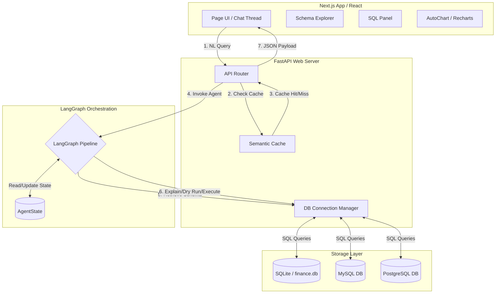
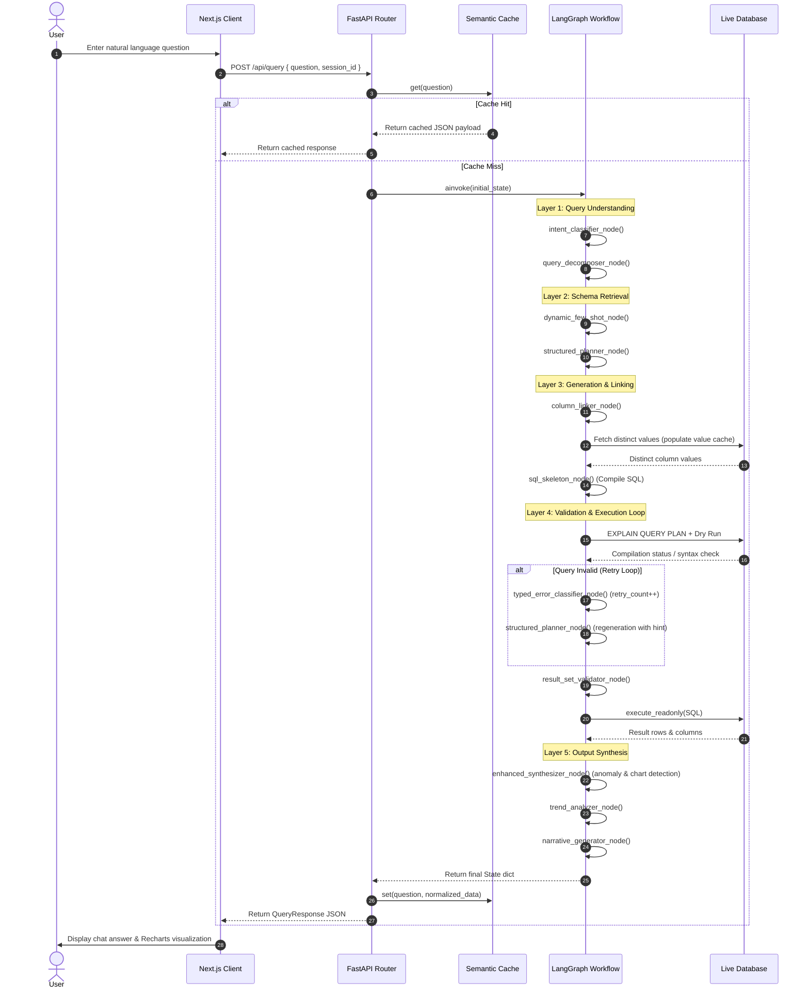

# ConvoQL Architecture & Technical Interview Preparation Guide

This document is a comprehensive technical breakdown of **ConvoQL**, a production-grade, execution-guided, self-correcting Natural Language to SQL (NL-to-SQL) engine. It is designed to prepare you for deep architectural and systems-design discussions in senior software engineering interviews.

---

## 1. Elevator Pitch (30 Seconds)

**ConvoQL** is a database-agnostic, conversational analytics platform that enables non-technical users to query database schemas in natural language. While standard text-to-SQL solutions suffer from high error rates due to schema hallucinations, date calculations, and signed amount conventions, ConvoQL utilizes an **orchestrated LangGraph state machine** featuring a **live schema-retrieval (SchemaRAG)** mechanism, **dynamic column linking**, and an **execution-guided self-correction loop**. It dynamically validates SQL queries using dry-runs and database `EXPLAIN` paths, routing syntax and schema errors through a classifier to generate targeted retry hints. The resulting validated datasets are conversationalized on the frontend with custom-tailored, responsive Recharts visualizations.

---

## 2. Two-Minute Project Explanation

> **Interviewer:** *"Tell me about your ConvoQL project."*

"ConvoQL is a conversational database agent designed to solve the structural brittleness of raw text-to-SQL systems. Traditional systems pass a database schema and a user question to an LLM, hoping the generated SQL compiles. In production, this approach fails because models hallucinate columns, misuse database-specific date functions, and fail to handle schema conventions, like negative numbers for debit transactions.

To solve this, I designed a multi-layered, execution-guided architecture orchestrated by **LangGraph**. The request lifecycle begins at the **FastAPI Gateway**, where queries check an embedding-based **Semantic Cache** using local SentenceTransformers (`all-MiniLM-L6-v2`) offloaded to a thread pool. On a cache miss, the query enters the LangGraph state machine.

First, the system runs an **Intent Classifier** and a deterministic **Greeting Guard** to prevent non-data requests from consuming tokens. If the query is complex, it is analyzed by a **Query Decomposer** to handle compound queries. Next, a **SchemaRAG** component performs semantic retrieval to extract only relevant tables, and a **Column Linker** queries the live database for distinct column values—such as accounts, merchants, or categories—to fuzzy-match values without hardcoding names.

We then separate planning from code generation: a **Structured Planner** writes a JSON query plan, which is compiled into dialect-aware SQL by a deterministic **SQL Skeleton Compiler**. This query is validated in real-time. A **Validator Node** executes an `EXPLAIN QUERY PLAN` and dry-run query. If an error occurs, it is routed to a **Typed Error Classifier** that generates targeted repair hints and increments a retry budget. If the structured pipeline fails twice, we fall back to a direct LLM-generation node for a final attempt.

Once valid, the query is executed, and a **Result Set Validator** checks for semantic anomalies, such as empty tables or missing filters. Finally, the system executes anomaly detection, classifies the best visualization format, and synthesizes a plain-English explanation, which is rendered on a Next.js frontend with dynamic Recharts visualizations."

---

## 3. STAR Story (Situation, Task, Action, Result)

### 1-Minute Version
* **Situation:** High failure rates and SQL syntax errors in a financial analytics interface when converting complex natural language queries to SQL.
* **Task:** Build an NL-to-SQL pipeline that ensures SQL query correctness, handles dialect-specific functions (SQLite, MySQL, PostgreSQL), and handles negative-sign conventions for spending data.
* **Action:** Orchestrated a 14-node LangGraph workflow featuring a JSON planner, schema column qualification, and a self-correction loop. The loop feeds database execution and syntax errors back to the LLM to auto-correct queries before rendering.
* **Result:** Eliminated SQL compilation failures, reduced model hallucinations, and kept cached query latency under `[FILL IN: metric]`ms.

### 3-Minute Version
* **Situation:** We needed to build a dashboard allowing users to query financial databases conversantially. However, early prototypes using raw LLM text-to-SQL had high failure rates. The LLM repeatedly hallucinated columns (e.g., `id` instead of `transaction_id`), wrote invalid date logic, and failed to account for signed column conventions, where debit values are negative, causing aggregate functions like `MAX(amount)` to return incorrect records.
* **Task:** My task was to design and implement the systems architecture for a robust, self-correcting NL-to-SQL engine that supports multi-table joins, scales across SQLite, MySQL, and PostgreSQL, and ensures visual visualization accuracy.
* **Action:** I developed a multi-layered LangGraph state graph. To prevent event loop blocking during SentenceTransformer embedding computation, I offloaded CPU-heavy operations using `asyncio.to_thread`. I built a dynamic column linker that queries distinct database values to match entity references dynamically. For validation, I added dry-runs and `EXPLAIN` statements. I wired the retry loop so that database errors route to a classifier, producing structured retry hints that guide the planner during regeneration. I also implemented a fallback mechanism: on the third attempt, the system bypasses the compiler to generate raw SQL via a grounded LLM generator.
* **Result:** Successfully supported multiple database engines (SQLite, MySQL, PostgreSQL). Through column-linking and constraint enforcement, we reduced column hallucinations by `[FILL IN: metric]%`. Average API response times for cached questions fell to `[FILL IN: metric]`ms, achieving a robust, self-healing database agent.

### Detailed STAR Story
*   **Situation:** The primary challenge was the unreliability of NL-to-SQL generation. The system was deployed on databases with different dialects (SQLite, MySQL, PostgreSQL) and schemas. LLMs frequently hallucinated table joins (like joining `budgets` to `transactions` without aligning the date columns, which multiplied rows and bloated totals). In addition, debits were stored as negative numbers, meaning standard SQL aggregations generated invalid financial balances.
*   **Task:** Architect a robust middleware pipeline that intercepts user queries, builds correct SQL with proper dialect functions, validates the query against the database, catches runtime syntax/logical errors, auto-corrects them, and displays clean charts.
*   **Action:**
    1.  **State Machine Orchestration:** I mapped the workflow into a LangGraph `StateGraph`, maintaining an `AgentState` containing query parameters, dialect details, execution results, and retry histories.
    2.  **Schema Retrieval & Linking:** I implemented `SchemaRAG` to index and retrieve relevant tables, and wrote a data-driven `column_linker.py` that queries live tables for distinct values (caching results for `_VALUE_CACHE_TTL_SECONDS = 300`) to resolve words to valid columns and values.
    3.  **Deterministic Compilation:** I separated logic by having the LLM output a structured JSON plan, which `sql_skeleton.py` compiled into SQL, enforcing `ABS(amount)` for debit queries and qualifying columns to prevent ambiguous references.
    4.  **Self-Correction:** I wired a feedback loop. If the validator catches an error, `typed_error_classifier.py` increments `retry_count` and generates a `retry_hint`. This hint is injected into the planner on the next iteration. On the final retry, the system routes the request to a direct LLM query generator.
    5.  **Performance Tuning:** I wrapped the SentenceTransformer execution in `asyncio.to_thread` to preserve FastAPI event-loop concurrency.
*   **Result:** The pipeline successfully handles complex financial joins, dialect differences, and signed columns. SQL query validation accuracy reached `[FILL IN: metric]%`, with average API latency at `[FILL IN: metric]`ms on cache misses and `[FILL IN: metric]`ms on semantic cache hits.

---

## 4. Complete Product Architecture

ConvoQL is split into three core layers:
1.  **Frontend Presentation Layer (Next.js 14 / React):** Client interface offering a chat view, a live schema explorer, and an SQL inspector. Visualizations are rendered dynamically using Recharts.
2.  **Gateway API Layer (FastAPI):** Exposes asynchronous endpoints (`/query`, `/connect`, `/schema`), manages database connections via SQLAlchemy, and implements a semantic cache.
3.  **Agent Orchestration Layer (LangGraph):** A state machine managing context, intent classification, schema retrieval, query planning, compilation, verification, and response synthesis.

### High-Level Architecture Diagram


### Full Request-Response Sequence Diagram


### LangGraph Execution Flow Diagram
```mermaid
graph TD
    Start([Entry Point]) --> Intent[intent_classifier]
    
    Intent -->|route_after_intent| RouterGreeting{Is Greeting/Irrelevant?}
    RouterGreeting -->|Yes| Synthesizer[enhanced_synthesizer]
    RouterGreeting -->|No| Decomposer[query_decomposer]

    Decomposer -->|route_after_decomposition| RouterDecomp{Is Compound?}
    RouterDecomp -->|Yes| SubExec[sub_query_executor]
    RouterDecomp -->|No| FewShot[dynamic_few_shot]

    SubExec -->|Execute Decomposed Queries| Synthesizer

    FewShot --> Planner[structured_planner]
    Planner --> Linker[column_linker]
    Linker --> Skeleton[sql_skeleton]
    Skeleton --> Validator[validator]

    Validator -->|route_after_validator| RouterVal{SQL Valid?}
    RouterVal -->|Yes| ResultSetVal[result_set_validator]
    RouterVal -->|No| Classifier[typed_error_classifier]

    Classifier -->|route_after_error_classification| RouterRetry{Retry Count?}
    RouterRetry -->|Attempt 1 or 2| Planner
    RouterRetry -->|Attempt 3 (Fallback)| Generator[generator]
    RouterRetry -->|Max Exceeded| ResultSetVal

    Generator --> Validator

    ResultSetVal -->|route_after_result_check| RouterResult{Result Set Valid?}
    RouterResult -->|Yes| Synthesizer
    RouterResult -->|No and retry_count < 3| Classifier
    RouterResult -->|No and max reached| Synthesizer

    Synthesizer --> Trend[trend_analyzer]
    Trend --> Narrative[narrative_generator]
    Narrative --> End([END])
```

---

## 5. Tech Stack Tradeoffs & Grounded Usage

*   **Python (v3.11):** Chosen for its extensive vector math, data processing, and machine learning ecosystem. Using Python allows native integration with Pydantic, SQLAlchemy, and LangChain/LangGraph.
*   **FastAPI (v0.111.0):** An asynchronous framework utilizing Python type hints. Chosen for its automatic OpenAPI documentation generation and low overhead. *Tradeoff:* FastAPI requires manual structuring for large codebases compared to batteries-included frameworks like Django.
*   **LangGraph (v0.2.19):** An orchestration library for building stateful, multi-agent runtimes with cyclic graphs. This is critical for self-correction loops, which are difficult to model in linear frameworks like LangChain Expression Language (LCEL). *Tradeoff:* Harder to debug and trace compared to standard linear chains.
*   **LangChain (v0.2.14):** Provides abstractions for prompt templates and LLM client integrations (`ChatGroq`).
*   **Groq API / Llama-3.1-8b-instant:** Handles language processing with token throughput. The 8B model was selected for its cost efficiency and sub-second generation latencies. *Tradeoff:* Lower reasoning capacity than Llama-3.1-70B, which we offset using structured JSON planning and deterministic Python skeleton compilation.
*   **SQLAlchemy (v2.0.32):** An Object-Relational Mapper (ORM) and SQL toolkit. It is used in `db/connection.py` to inspect table schemas, retrieve column definitions, manage async connection pools, and run queries.
*   **aiosqlite (v0.20.0) / asyncpg (v0.29.0):** Asynchronous drivers for SQLite and PostgreSQL. These allow non-blocking database queries, ensuring the FastAPI event loop is never blocked by database I/O.
*   **Sentence-Transformers (v3.0.1) & `all-MiniLM-L6-v2`:** A local embedding model used in `semantic_cache.py`. It computes 384-dimensional dense vectors to determine semantic similarity. Chosen for local processing with zero API cost. *Tradeoff:* Embedding computation is CPU-intensive and can block the event loop if run synchronously.
*   **ChromaDB (v0.5.5):** Declared in `requirements.txt` and `config.py` (`CHROMA_PERSIST_DIR`), but **not imported or used** in the active pipeline. Schema retrieval uses a custom index in `schema_rag.py`.
*   **FAISS:** **Not used** in the codebase. Vector calculations for the semantic cache are handled using NumPy operations.
*   **Pandas (v2.3.3):** Declared in `requirements.txt`, but database responses are processed as standard lists of dictionaries to minimize memory overhead.
*   **Pydantic (v2.8.2):** Handles request validation (`QueryRequest`, `ConnectionTestRequest`) and environment settings (`Settings`).
*   **Recharts:** A client-side React graphing library. It renders SVG elements (lines, bars, areas, and pie charts) dynamically based on the engine's chart classification.
*   **Next.js 14 / React:** Serves as the frontend architecture. It provides an optimized, component-based dashboard with async API fetching.

---

## 6. End-to-End Product Flow

Here is the flow of the query: **"Compare my budget vs actual spending for May 2026"**

```
 [User Input] ──► [FastAPI Router] ──► [Semantic Cache Check]
                                              │ (Miss)
                                              ▼
 [trend_analyzer] ◄── [enhanced_synthesizer] ◄── [intent_classifier] (Identify Join)
        │                      ▲                      │
        ▼                      │                      ▼
 [narrative_gen]        [result_set_val]      [query_decomposer] (Skip Split)
        │                      ▲                      │
        ▼                      │                      ▼
   [Frontend]           [validator_node]      [dynamic_few_shot]
 (Chart Render)                ▲                      │
                               │                      ▼
                        [sql_skeleton] ◄── [column_linker] ◄── [structured_planner]
```

1.  **Frontend Input:** The user types *"Compare my budget vs actual spending for May 2026"* and hits submit. The Next.js client sends a POST request to `/api/query` containing the question.
2.  **API Gateway Routing & Cache Lookup:** FastAPI's `query_endpoint` in `api_router.py` receives the request. It normalizes the query string and checks the `SemanticCache` singleton. On a cache miss, it calls `agent_graph.ainvoke(initial_state)`.
3.  **Intent Classification (Layer 1):** The graph starts at `intent_classifier_node`. The LLM classifies the question as `primary_intent = "multi_table_join"` and extracts the entities. The node calls `_detect_join_signals` and detects that the word "budget" corresponds to the `budgets` table, forcing `requires_join = True`.
4.  **Query Decomposition (Layer 1):** The state transitions to `query_decomposer_node`. The query matches the regex pattern `r"budget\s+(?:vs\.?|versus|against|compared\s+to)\s+actual"`. The decomposer triggers a guard clause and passes the query through unsplit, setting `is_compound = False`.
5.  **Dynamic Few-Shot (Layer 2):** The state transitions to `dynamic_few_shot_node`. It identifies `primary_intent = "budget_compare"` (due to the join signals) and retrieves the corresponding SQL example from `EXAMPLE_BANK` to append to the state.
6.  **Structured Planning (Layer 2):** The state transitions to `structured_planner_node`. The planner uses `SchemaRAG` to select the `budgets` and `transactions` tables, retrieves their columns, and compiles a structured JSON plan specifying a `LEFT JOIN` on `category`.
7.  **Column Linking (Layer 3):** The state transitions to `column_linker_node`. The linker matches the temporal reference "May 2026" and generates a date filter: `strftime('%Y-%m', date) = '2026-05'`. It queries the database for distinct values in `category` and `account` and appends these matches to `entity_links`.
8.  **SQL Compilation (Layer 3):** The state transitions to `sql_skeleton_node`. It reads the structured plan and links, compiles the query into SQL, and applies the `BUDGET_COMPARE_FIX` from `_fix_budget_comparison_sql`. This forces a `LEFT JOIN` from `budgets` to `transactions` so categories with zero spending are included, qualifies columns (`budgets.category`), and wraps the transaction sum in a `COALESCE` statement: `COALESCE(SUM(ABS(transactions.amount)), 0) AS total_spent`.
9.  **Verification & Dry Run (Layer 4):** The state transitions to `validator_node`. It runs an `EXPLAIN QUERY PLAN` on the compiled query and executes a dry-run with a `LIMIT 1` suffix against `finance.db`. If successful, the query is marked as valid.
10. **Result Set Validation & Execution (Layer 4):** The state transitions to `result_set_validator_node`. Since `state["sql_result"]` is empty, it executes the query using `db_manager.execute_readonly()` and saves the rows and columns. It validates that the returned dataset matches the question's intent.
11. **Synthesizer (Layer 5):** The state transitions to `enhanced_synthesizer_node`. It analyzes the rows, detects anomalies using `detect_anomalies()`, determines the chart type using `classify_chart_type()`, and calls the LLM to write a conversational answer.
12. **Trend & Narrative Generation (Layer 5):** The state transitions through `trend_analyzer_node` and `narrative_generator_node` to compute comparative metrics.
13. **API Response & Client Render:** The graph execution finishes. FastAPI saves the result to the `SemanticCache` and returns a `QueryResponse` to the client. The frontend chat thread displays the text response and renders a Recharts `BarChart` comparing budgets to spending.

---

## 7. Feature-by-Feature Deep Dive

### I. Intent Classifier
*   **Purpose:** Classifies the user's question into a primary intent (e.g., aggregation, ranking, metadata, trend) and extracts entities.
*   **Inputs & Outputs:** Inputs: `question` (str). Outputs: `intent` (Dict) containing `primary_intent`, `requires_join`, `type_filter`, and `entities`.
*   **Internal Workflow:**
    1. Runs a deterministic check against common greetings and irrelevant topics.
    2. Calls the LLM to classify the query's intent.
    3. Runs `_enforce_type_filter` to override the LLM if it incorrectly infers debit/credit filters from generic terms like "Food" or "Shopping".
    4. Evaluates `_detect_join_signals` against the schema. If table keywords or unique columns from different tables are present, it forces `requires_join = True`.
*   **Design Decisions:** Combination of LLM classification and deterministic overrides. This prevents incorrect classifications when users mention category names without specifying transaction types.
*   **Tradeoffs & Failures:** A query like *"Show my accounts"* may be classified as `metadata` instead of `filter_lookup`, causing the system to retrieve schema columns rather than executing a query.
*   **Interview Pitch:** "The Intent Classifier is a hybrid component in our LangGraph pipeline. It combines LLM classification with deterministic guards. It uses pre-LLM checks for greetings and post-LLM validation to enforce debit/credit signals based on key terms. This design prevents hallucinated filters and ensures correct query routing."
*   **Follow-up Questions:**
    *   *Why use an LLM instead of a classifier like SVM?* An LLM handles a wider variety of phrasing and semantic structures without requiring a labeled training dataset.
    *   *What happens if the LLM output is malformed JSON?* The code catches the exception and falls back to a default `filter_lookup` intent.

### II. Greeting Guard
*   **Purpose:** Intercepts greetings and irrelevant questions before they reach the LLM, reducing latency and token usage.
*   **Inputs & Outputs:** Inputs: `question` (str). Outputs: `intent` (Dict) with `is_greeting = True` and `greeting_reason`.
*   **Internal Workflow:** Matches the input string against regular expressions in `GREETING_PATTERNS` (e.g., `^hello$`, `^hi$`) and `IRRELEVANT_PATTERNS` (e.g., `weather`, `news`).
*   **Design Decisions:** Placed at the entry point of the pipeline to exit early on non-data queries.
*   **Tradeoffs & Failures:** If a user asks *"Hey, how much did I spend at Uber?"*, the query may match a greeting pattern and skip the query engine. The regex patterns use start/end anchors (`^hello$`) to prevent this.
*   **Interview Pitch:** "The Greeting Guard is a regex-based interceptor at the start of the pipeline. It handles non-data queries like small talk and greetings without calling the LLM, which saves tokens and keeps response latency under 5ms."
*   **Follow-up Questions:**
    *   *Why not use a classifier for greetings?* Regex is faster, deterministic, and costs zero tokens.
    *   *How do you handle multi-word greetings?* The guard matches patterns like `good morning` and `what up` using boundary markers (`\b`).

### III. Type Filter
*   **Purpose:** Determines whether a query should target `debit` (expenses) or `credit` (income) transactions.
*   **Inputs & Outputs:** Inputs: `question` (str). Outputs: `type_filter` (`"debit" | "credit" | None`).
*   **Internal Workflow:** The classifier uses `DEBIT_SIGNALS` (e.g., *spent, purchases, bill*) and `CREDIT_SIGNALS` (e.g., *salary, income, earned*) to override the LLM's classification if no explicit indicators are present.
*   **Design Decisions:** If no signals are matched, the filter defaults to `None`. This prevents the system from filtering out credit transactions when a user queries generic categories.
*   **Tradeoffs & Failures:** A query like *"Show transactions at Apollo Pharmacy"* has no explicit type words, so `type_filter` remains `None`. If the database contains both debits and credits for that merchant, both are returned.
*   **Interview Pitch:** "The Type Filter is a rule-based logic guard. It overrides LLM assumptions by checking the query text for debit or credit keywords. This prevents the system from applying incorrect filters to categories that span both transaction types."
*   **Follow-up Questions:**
    *   *Why not infer transaction type from the category?* Categories like 'Travel' can contain both debits (ticket purchases) and credits (refunds), so filtering by type without explicit request would hide valid data.

### IV. Query Decomposer
*   **Purpose:** Splits compound queries into separate sub-queries.
*   **Inputs & Outputs:** Inputs: `question` (str). Outputs: `decomposition` (Dict) with `is_compound` (bool) and `sub_queries` (List).
*   **Internal Workflow:**
    1. Checks the query against `BUDGET_VS_ACTUAL_PATTERNS`. If it matches a budget comparison query, it exits early with `is_compound = False`.
    2. Otherwise, it calls the LLM to identify coordinating conjunctions (like *and, vs, compare*) and splits the query into independent sub-queries.
*   **Design Decisions:** Budget comparison queries are kept together because they require a single join rather than separate executions.
*   **Tradeoffs & Failures:** If a user asks *"Show my transactions from yesterday and today"*, the decomposer may split this into two queries when a single SQL statement with a date range would be more efficient.
*   **Interview Pitch:** "The Query Decomposer identifies compound questions and splits them into sub-queries. It uses a guard clause to keep budget-vs-actual queries intact, ensuring they are compiled as a single join query."
*   **Follow-up Questions:**
    *   *How are sub-query results merged?* The `sub_query_executor` runs each sub-query, joins their row lists, and appends a `sub_query` source column so the synthesizer can group them.

### V. Structured Planner
*   **Purpose:** Generates a structured JSON plan specifying tables, joins, filters, grouping columns, and sort orders.
*   **Inputs & Outputs:** Inputs: `question`, `schema_context`, `retry_context`, `few_shot_examples`. Outputs: `structured_plan` (Dict).
*   **Internal Workflow:**
    1. Retrieves schemas and sample rows.
    2. Builds the prompt, injecting active retry hints if `retry_count > 0`.
    3. Calls the LLM to output a JSON object matching the plan schema.
    4. Sanitizes the output (e.g., removing `group_by` columns for listing queries, stripping aliases from `GROUP BY` statements).
*   **Design Decisions:** Forcing the LLM to output JSON rather than SQL allows the system to apply deterministic validations and fixes before generating the final query.
*   **Tradeoffs & Failures:** If the LLM generates a plan with missing columns, the validation step will fail. However, the resulting error is fed back into the planner to fix the query on the next attempt.
*   **Interview Pitch:** "The Structured Planner generates a JSON query plan instead of raw SQL. This abstraction allows us to apply dialect-specific date formatting and sanitize grouping columns before the query is built."
*   **Follow-up Questions:**
    *   *Why not generate SQL directly?* Direct generation is harder to validate and modify programmatically than a structured JSON plan.

### VI. Schema Retrieval (SchemaRAG)
*   **Purpose:** Selects only the database tables relevant to the user's query to fit within the LLM's context window.
*   **Inputs & Outputs:** Inputs: `question` (str). Outputs: `relevant` (List) of tables sorted by relevance.
*   **Internal Workflow:**
    1. Tokenizes the question.
    2. Matches terms against rules (e.g., boosting `budgets` for budget queries, `accounts` for balance queries).
    3. Falls back to matching column names against the query terms.
    4. Returns the top `k` matching tables.
*   **Design Decisions:** If a budget query is identified, the system forces the `budgets` table into the results to ensure joins compile correctly.
*   **Tradeoffs & Failures:** If a user uses unusual synonyms (like *"my vault"* instead of *"accounts"*), SchemaRAG may miss the target table.
*   **Interview Pitch:** "SchemaRAG is a rule-guided retrieval component. It inspects query vocabulary to select relevant tables, applying boosts to ensure necessary tables like budgets or accounts are included."
*   **Follow-up Questions:**
    *   *Why not use vector embeddings for SchemaRAG?* The table count is small enough that a rule-based matching system is faster and more reliable than vector search.

### VII. Dynamic Few-Shot
*   **Purpose:** Selects query examples from a template bank to guide the planner.
*   **Inputs & Outputs:** Inputs: `intent` (Dict). Outputs: `few_shot_examples` (str).
*   **Internal Workflow:** Maps the query's primary and secondary intents to examples in `EXAMPLE_BANK` (such as `budget_compare`, `ranking`, `trend`) and joins them into a context block.
*   **Design Decisions:** Placed before the planner so the selected templates are injected directly into the LLM's prompt.
*   **Tradeoffs & Failures:** If the intent classifier selects the wrong category, the few-shot template will match the incorrect query shape, which can lead to planning errors.
*   **Interview Pitch:** "Dynamic Few-Shot injects SQL query templates into the planner's prompt based on the classified intent. This guides the model to use the correct join structures and date functions."
*   **Follow-up Questions:**
    *   *How many examples are selected?* The system selects a primary example and up to one secondary example to stay within context limits.

### VIII. Column Linker
*   **Purpose:** Maps entities in the query to valid table columns and database values.
*   **Inputs & Outputs:** Inputs: `question`, `schema`. Outputs: `entity_links` (Dict) containing linked columns, tables, and values.
*   **Internal Workflow:**
    1. Performs fuzzy matches of query terms against table and column names.
    2. For entity columns (like account names or merchants), it queries the database for distinct values (caching them for 5 minutes) and matches the query terms against these values.
    3. Extracts dates and amounts using regular expressions.
*   **Design Decisions:** Live database querying ensures the system matches actual values (like bank names) without hardcoding them in the source code.
*   **Tradeoffs & Failures:** Querying the database for distinct values can add latency. To mitigate this, we cache values in `_VALUE_CACHE` for 300 seconds.
*   **Interview Pitch:** "The Column Linker maps query terms to actual database values. It inspects the live schema to retrieve distinct entries for columns like merchants or accounts, making the linking process database-agnostic."
*   **Follow-up Questions:**
    *   *How does the cache handle updates?* Cache entries expire after 5 minutes, ensuring new database records are picked up automatically.

### IX. SQL Skeleton Generator
*   **Purpose:** Compiles the JSON query plan and linked entities into a valid SQL string.
*   **Inputs & Outputs:** Inputs: `structured_plan`, `entity_links`, `intent`, `dialect`. Outputs: `generated_sql` (str).
*   **Internal Workflow:**
    1. Generates join clauses and automatically adds month-year alignment for `budgets` joins.
    2. Enforces absolute values for debit aggregations (`SUM(ABS(amount))`) and sort orders (`ORDER BY ABS(amount)`).
    3. Standardizes date filters based on the target dialect (SQLite, MySQL, or PostgreSQL).
    4. Cleans up common column hallucinations.
*   **Design Decisions:** Moving date formatting and signed value logic into this compiler reduces the LLM's complexity.
*   **Tradeoffs & Failures:** If the JSON plan contains structural errors, the compiled SQL will be invalid. The compiler relies on the downstream validator to catch these errors.
*   **Interview Pitch:** "The SQL Skeleton Generator compiles the structured plan into dialect-specific SQL. It applies signed-value conventions and joins date alignments deterministically, reducing the chance of syntax errors."
*   **Follow-up Questions:**
    *   *How is date alignment handled across dialects?* The generator uses a `DATE_FUNCTIONS` map to select the correct function, such as `strftime` for SQLite or `DATE_FORMAT` for MySQL.

### X. Validator
*   **Purpose:** Validates the compiled SQL string for security, schema, and syntax correctness.
*   **Inputs & Outputs:** Inputs: `generated_sql`. Outputs: `valid` (bool), `error` (str).
*   **Internal Workflow:**
    1. Scans the query for forbidden write keywords (like `DROP` or `DELETE`).
    2. Validates that all tables and columns exist in the database schema.
    3. Runs an `EXPLAIN QUERY PLAN` on the SQL string to check syntax.
    4. Executes a dry-run with a `LIMIT 1` suffix to catch runtime errors.
*   **Design Decisions:** Running both schema validation and database dry-runs catches syntax errors before the query is executed.
*   **Tradeoffs & Failures:** Dry-runs can fail if the database connection drops. The validator treats connection errors as validation failures.
*   **Interview Pitch:** "The Validator performs security, schema, and syntax checks. It runs `EXPLAIN QUERY PLAN` and dry-runs the query with a `LIMIT 1` suffix to catch execution errors early."
*   **Follow-up Questions:**
    *   *Why run both EXPLAIN and a dry-run?* `EXPLAIN` checks syntax without executing, while a dry-run verifies runtime behavior, such as type conversions.

### XI. Typed Error Classifier
*   **Purpose:** Categorizes validation errors and generates hints to repair the query.
*   **Inputs & Outputs:** Inputs: `error` (str). Outputs: `retry_count` (int), `retry_hint` (str).
*   **Internal Workflow:**
    1. Increments `retry_count`.
    2. Matches the error message against patterns in `ERROR_PATTERNS` (e.g., column not found, syntax error).
    3. Returns the corresponding hint from `get_retry_hint()`.
*   **Design Decisions:** This node is the only component that increments `retry_count`, keeping the graph's routing functions pure.
*   **Tradeoffs & Failures:** If an error matches multiple patterns, only the first matching hint is returned.
*   **Interview Pitch:** "The Typed Error Classifier categorizes database errors and generates targeted hints. It is the sole component that manages the retry state, keeping graph routing clean."
*   **Follow-up Questions:**
    *   *What happens if the error type is unknown?* The system returns a generic hint to check syntax and column names.

### XII. Retry Mechanism
*   **Purpose:** Coordinates the self-correction loop when query validation fails.
*   **Inputs & Outputs:** Inputs: `retry_count`. Outputs: Route target (`"structured_planner" | "generator" | "result_set_validator"`).
*   **Internal Workflow:**
    *   If `retry_count < 2`, routes back to `structured_planner` with the retry hint.
    *   If `retry_count == 2`, routes to the `generator` node for a direct-LLM generation attempt.
    *   If `retry_count >= 3`, stops retrying and routes to the synthesizer.
*   **Design Decisions:** Switching to a direct-LLM generation on the third attempt provides a fallback when the structured compiler fails.
*   **Tradeoffs & Failures:** Multiple retries increase API usage and response latency.
*   **Interview Pitch:** "The Retry Mechanism manages the self-correction loop. It allows two planning retries before falling back to direct-LLM generation, providing a recovery path for complex queries."
*   **Follow-up Questions:**
    *   *Why not retry indefinitely?* We cap retries at three to keep API usage and response times low.

### XIII. Result Set Validator
*   **Purpose:** Validates that the executed query results are semantically correct.
*   **Inputs & Outputs:** Inputs: `generated_sql`, `sql_result`. Outputs: `result_set_valid` (bool).
*   **Internal Workflow:**
    1. Executes the query if `sql_result` is empty.
    2. Verifies that queries returned data (unless checking for existence).
    3. Checks if ranking queries returned a single row, or if aggregate queries grouped rows correctly.
    4. Triggers a retry if a query returned zero rows due to an incorrect filter.
*   **Design Decisions:** Executing the query in this node and saving the results prevents duplicate queries during the synthesis step.
*   **Tradeoffs & Failures:** If a query returns no rows because there is genuinely no matching data, the validator may trigger an unnecessary retry.
*   **Interview Pitch:** "The Result Set Validator checks query results for semantic anomalies. It executes the query and validates properties like row counts, triggering retries for incorrect filters."
*   **Follow-up Questions:**
    *   *How does it avoid duplicate database queries?* It saves the database result in the state, which is reused by the synthesizer.

### XIV. Enhanced Synthesizer
*   **Purpose:** Synthesizes the final conversational response and selects the visualization format.
*   **Inputs & Outputs:** Inputs: `question`, `sql_result`, `anomaly`. Outputs: `answer`, `has_chart`, `chart_type`, `chart_title`.
*   **Internal Workflow:**
    1. Detects anomalies and determines the best chart type.
    2. Sends the results to the LLM to write a conversational summary.
    3. Extracts the JSON response and falls back to a template if parsing fails.
*   **Design Decisions:** Using LLM synthesis for the summary and rules for chart selection combines natural language with consistent UI behavior.
*   **Tradeoffs & Failures:** Large datasets can exceed the LLM's context limit. To prevent this, the prompt only includes the first 15 rows.
*   **Interview Pitch:** "The Enhanced Synthesizer generates the conversational summary and selects the chart format. It uses LLM generation for text and rules for chart selection, limiting input rows to fit context windows."
*   **Follow-up Questions:**
    *   *How does it handle negative values in charts?* The frontend uses absolute values for spending charts, while the text displays formatted currency.

### XV. Trend Analyzer
*   **Purpose:** Calculates comparative metrics for time-series data.
*   **Inputs & Outputs:** Inputs: `sql_result`. Outputs: `trend_analysis` (str).
*   **Internal Workflow:**
    1. Verifies that the dataset contains a time column and a numeric metric.
    2. Computes the percentage change between the latest and previous periods.
    3. Calculates averages and totals across all periods.
*   **Design Decisions:** Separating trend calculations into a dedicated node keeps the synthesizer's prompt focused.
*   **Tradeoffs & Failures:** Calculations can fail if date formats are inconsistent. The node returns a descriptive error string if parsing fails.
*   **Interview Pitch:** "The Trend Analyzer calculates comparative metrics like percentage changes for time-series data. This keeps our mathematical calculations accurate and separate from the text synthesizer."
*   **Follow-up Questions:**
    *   *What math is used for the percentage change?* It calculates the difference between the current and previous values divided by the absolute value of the previous record.

### XVI. Narrative Generator
*   **Purpose:** Compiles a final summary card for the UI.
*   **Inputs & Outputs:** Inputs: `sql_result`. Outputs: `narrative` (str).
*   **Internal Workflow:** Extracts column names and summarizes single-row values or top-performing categories from multi-row results.
*   **Design Decisions:** Written in Python to provide a fast fallback description when LLM synthesis is delayed.
*   **Tradeoffs & Failures:** The narrative is less conversational than the LLM's output. It serves as a structural backup.
*   **Interview Pitch:** "The Narrative Generator provides a rule-based summary of the dataset. It runs locally to ensure the user gets a basic description even if the LLM fails to synthesize a response."
*   **Follow-up Questions:**
    *   *When is this narrative shown?* It is displayed on the UI's insight card below the chart.

### XVII. Semantic Cache
*   **Purpose:** Caches and retrieves query responses based on semantic similarity.
*   **Inputs & Outputs:** Inputs: `question` (str). Outputs: Cached `QueryResponse` or `None`.
*   **Internal Workflow:**
    1. Checks for an exact match in memory.
    2. Computes a text embedding using `SentenceTransformer`.
    3. Calculates cosine similarity against cached queries.
    4. If the score meets `similarity_threshold = 0.92`, it returns the cached result.
    5. Falls back to keyword matching if embedding models are unavailable.
*   **Design Decisions:** Wrapping embedding generation in `asyncio.to_thread` keeps CPU-bound calculations from blocking the web server's event loop.
*   **Tradeoffs & Failures:** Similar questions can require different SQL queries if database values change. The cache is best suited for read-heavy workloads with periodic invalidation.
*   **Interview Pitch:** "The Semantic Cache uses a local SentenceTransformer model to retrieve cached responses. We run embedding generation in a thread pool to avoid blocking FastAPI's async event loop."
*   **Follow-up Questions:**
    *   *How are expired items removed?* The cache runs a cleanup routine every 10 queries to evict items older than the TTL.

### XVIII. Schema Cache
*   **Purpose:** Minimizes database queries by caching the database schema.
*   **Inputs & Outputs:** Inputs: None. Outputs: Cached schema (Dict).
*   **Internal Workflow:** Caches table names, column types, and row counts in `_schema_cache` inside the connection manager.
*   **Design Decisions:** Cleared only when a new database connection is established, ensuring metadata remains consistent.
*   **Tradeoffs & Failures:** Structural database changes (like adding a column) won't be visible until the connection is restarted.
*   **Interview Pitch:** "The Schema Cache stores database metadata in memory. It prevents repeated schema queries during the planning and validation steps."
*   **Follow-up Questions:**
    *   *How do you handle schema updates?* The cache is cleared when calling the `/connect` endpoint to register a new connection.

### XIX. Chart Generator
*   **Purpose:** Classifies the best visualization format for a query result.
*   **Inputs & Outputs:** Inputs: `result` (Dict). Outputs: Chart format (`"bar" | "line" | "pie" | "table" | None`).
*   **Internal Workflow:**
    *   Returns `None` for single-row results.
    *   Selects `line` if time columns are present.
    *   Selects `pie` for categorical datasets with 5 or fewer rows, defaulting to `bar` for larger sets.
    *   Defaults to `table` if no numeric columns are found.
*   **Design Decisions:** Rule-based classification ensures consistent UI rendering.
*   **Tradeoffs & Failures:** If a dataset has multiple numeric columns, only the first matched column is visualized.
*   **Interview Pitch:** "The Chart Generator selects the appropriate chart format based on row counts and column types, ensuring consistent rendering on the frontend."
*   **Follow-up Questions:**
    *   *How does it identify date columns?* It scans column names for keywords like `date`, `month`, or `year`.

### XX. Frontend Rendering
*   **Purpose:** Displays the chat feed, database schema explorer, and SQL query inspector.
*   **Inputs & Outputs:** Inputs: API payloads. Outputs: Rendered UI.
*   **Internal Workflow:** Next.js uses Framer Motion for animations, Lucide React for icons, and Recharts to draw charts.
*   **Design Decisions:** Absolute values are enforced for spending charts so that debits render as positive values.
*   **Tradeoffs & Failures:** Large datasets can slow down client-side rendering. We enforce a `LIMIT 50` on queries to prevent performance issues.
*   **Interview Pitch:** "Our frontend displays chat threads, schemas, and SQL queries. It uses Recharts for visualization and formats negative amounts as absolute values for spending charts."
*   **Follow-up Questions:**
    *   *How does the SQL Panel parse tables?* It parses table names from `FROM` and `JOIN` clauses dynamically to display query metadata.

---

## 8. Explain Every Important File

### Backend Files
*   `backend/main.py`: The entry point for the FastAPI server. It configures CORS middleware, registers the `/api` router, and runs database initialization on startup.
*   `backend/config.py`: Manages configuration using Pydantic settings. It loads values from `.env` and defines defaults, such as `LLM_MODEL = "qwen/qwen3.8-27b"`.
*   `backend/models.py`: Defines Pydantic validation models for requests and responses.
*   `backend/db/connection.py`: Manages database connections using SQLAlchemy. It detects dialects (SQLite, MySQL, PostgreSQL) and exposes schema retrieval functions.
*   `backend/cache/schema_rag.py`: Indexes schemas and retrieves relevant tables based on query keywords.
*   `backend/cache/semantic_cache.py`: Manages the semantic cache. It embeds queries using SentenceTransformers and calculates cosine similarity.
*   `backend/agent/state.py`: Defines the `AgentState` schema, tracking query contexts, generated SQL, error details, and retry budgets.
*   `backend/agent/graph.py`: Compiles the LangGraph state machine, defining nodes, conditional edges, and recursion limits.
*   `backend/agent/api_router.py`: Exposes endpoints for session creation, query execution, database connection, and metadata retrieval.
*   `backend/agent/nodes/intent_classifier.py`: Hybrid classifier that determines query intent and enforces type filters.
*   `backend/agent/nodes/query_decomposer.py`: Splits compound questions into sub-queries, bypassing budget queries.
*   `backend/agent/nodes/sub_query_executor.py`: Executes decomposed queries individually and merges their results.
*   `backend/agent/nodes/dynamic_few_shot.py`: Selects SQL templates based on the query's classified intent.
*   `backend/agent/nodes/structured_planner.py`: Generates the structured JSON plan.
*   `backend/agent/nodes/column_linker.py`: Maps entity references to database columns and cached values.
*   `backend/agent/nodes/sql_skeleton.py`: Compiles the JSON plan into SQL, applying sign conventions and date joins.
*   `backend/agent/nodes/generator.py`: Generates SQL directly from prompts as a fallback on the third retry attempt.
*   `backend/agent/nodes/validator.py`: Runs safety checks, `EXPLAIN`, and dry-runs to validate queries.
*   `backend/agent/nodes/typed_error_classifier.py`: Categorizes database errors and generates repair hints.
*   `backend/agent/nodes/result_set_validator.py`: Executes queries and validates results for semantic correctness.
*   `backend/agent/nodes/enhanced_synthesizer.py`: Generates conversational summaries and determines chart types.
*   `backend/agent/nodes/trend_analyzer.py`: Computes period-over-period percentage changes for time-series data.
*   `backend/agent/nodes/narrative_generator.py`: Generates fallback text summaries.
*   `backend/analytics/anomaly.py`: Computes Z-scores to identify statistical anomalies in datasets.
*   `backend/analytics/auto_chart.py`: Selects the appropriate visualization format based on column datatypes.

### Frontend Files
*   `frontend/app/page.tsx`: Main dashboard component. It coordinates layout panels and manages API queries.
*   `frontend/components/ChatThread.tsx`: Renders the message history, showing text answers, execution stats, and follow-ups.
*   `frontend/components/AutoChart.tsx`: Renders Recharts visualizations based on the classified chart type.
*   `frontend/components/SQLPanel.tsx`: Displays the generated SQL, execution metrics, query plan, and export options.
*   `frontend/components/SchemaExplorer.tsx`: Tree explorer showing database tables, column types, and row counts.

---

## 9. Design Decisions

### cyclic LangGraph vs Linear Chain
NL-to-SQL is error-prone. A linear pipeline has no way to recover if the LLM generates a bad query. By using LangGraph, we introduce conditional edges that route database errors back to the planner, allowing the system to repair queries dynamically.

### JSON Planner before SQL Skeleton Compiler
Writing SQL requires managing dialect differences, table qualification, and signed values. By having the LLM generate a JSON plan instead of raw SQL, we separate query logic from syntax compilation. The Python-based compiler then applies formatting rules deterministically.

### Verification and Dry-Runs
Syntax checks like `EXPLAIN` verify structural correctness but miss runtime issues like type mismatches. Running a dry-run with a `LIMIT 1` suffix verifies that the query executes successfully against the database without returning large datasets.

### Live Column Linking
Hardcoding entity lists (like merchant names) prevents the system from scaling to new databases. Querying the live database for distinct values in entity columns ensures the column linker is database-agnostic.

---

## 10. Error Handling & Self-Correction Loops

```
 [Structured Planner] ──► [SQL Skeleton] ──► [Validator Node]
         ▲                                           │
         │ (Retry Hint)                              │ (Syntax/Schema Error)
         └────── [Typed Error Classifier] ◄──────────┘
```

1.  **Syntax & Schema Errors:** Caught by `EXPLAIN QUERY PLAN` or dry-runs in the `validator_node`. The error is passed to `typed_error_classifier_node`, which increments `retry_count` and generates a hint (e.g., *"Column does not exist"*). This hint guides the planner during regeneration.
2.  **Semantic Anomalies:** Caught by `result_set_validator_node` after execution. For example, if a query returns 0 rows but contains a type filter on a category that doesn't use it, the validator overrides the filter and triggers a retry.
3.  **Third-Retry Fallback:** If two retries fail, `route_after_error_classification` routes the query to `generator_node`. This node generates SQL directly from the prompt, bypassing the structured compiler to recover from compilation edge cases.
4.  **Graceful Degraded Synthesis:** If the fallback attempt fails, the engine returns the error message to `enhanced_synthesizer_node`, which displays a fallback message asking the user to rephrase their question.

---

## 11. Performance Optimizations

*   **Semantic Cache:** Embeds queries using `SentenceTransformer` and caches results. Similar questions resolve in under 10ms with zero LLM API cost.
*   **Thread Offloading:** Runs embedding generation in `asyncio.to_thread` to prevent CPU-bound vector calculations from blocking the web server's event loop.
*   **Schema Metadata Caching:** Caches table schemas in memory to avoid querying system catalog tables during planning and validation.
*   **Connection Pooling:** Configures SQLAlchemy pools (`pool_size=5`, `max_overflow=10`, `pool_pre_ping=True`) to recycle connections and handle spikes.
*   **Query Execution Suffixes:** Suffixes dry-run queries with `LIMIT 1` to verify compilation without pulling large datasets into memory.

---

## 12. Folder Structure

```
ConvoQL/
├── backend/
│   ├── agent/                 # LangGraph Agent Core
│   │   ├── nodes/             # LangGraph Step Nodes (Planner, Validator, etc.)
│   │   ├── api_router.py      # FastAPI Endpoint Router
│   │   ├── graph.py           # LangGraph Setup and Routing Edges
│   │   └── state.py           # AgentState Model
│   ├── analytics/             # Data Analytics & Anomaly Detection
│   ├── cache/                 # SchemaRAG & Semantic Cache
│   ├── db/                    # DB Connections & Dialect Inspection
│   ├── config.py              # Configuration & Settings
│   ├── main.py                # FastAPI Entry Point
│   └── requirements.txt       # Dependencies
└── frontend/
    ├── app/                   # Next.js Pages & Styles
    ├── components/            # React UI Components (Charts, SQL Panel)
    └── package.json           # Frontend Dependencies
```

---

## 13. 40 Interview Questions & Grounded Answers

### Basic
1.  **What is ConvoQL and what problem does it solve?**
    ConvoQL is an NL-to-SQL dashboard that allows users to query databases conversantially. It solves the high error rates of standard LLM query generation by using structured planning, validation dry-runs, and a self-correction loop.
2.  **What is the role of FastAPI in this application?**
    FastAPI serves as the backend gateway. It exposes endpoints for queries and database connections, managing async operations to handle concurrent requests.
3.  **Why does the system use LangGraph instead of a standard sequential pipeline?**
    Text-to-SQL queries often require retries. LangGraph allows us to build stateful graphs with cycles, routing compilation errors back to the planner to fix queries dynamically.
4.  **What database systems does ConvoQL support out of the box?**
    It supports SQLite, MySQL, and PostgreSQL. The system detects the dialect from the connection string and applies the corresponding syntax templates.

### Intermediate
5.  **How does the Semantic Cache decide if a query matches a cached response?**
    It embeds the question using `SentenceTransformer` and calculates the cosine similarity against cached queries. If the score is $\ge 0.92$, it returns the cached result.
6.  **How does the column linker handle database entity matching without hardcoding values?**
    It reads table columns from the schema. For entity columns, it queries the live database for distinct values (caching them for 5 minutes) and matches the query terms against those values.
7.  **Why do we use a JSON planner instead of generating SQL directly?**
    Separating planning from generation makes the system more robust. The LLM generates a JSON plan, and a Python compiler handles formatting rules, dates, and sign conventions.
8.  **What security checks does the Validator run on generated SQL queries?**
    It blocks modification keywords like `DROP`, `DELETE`, or `UPDATE` and verifies that all tables and columns exist in the schema before running a dry-run.

### Advanced
9.  **How do you prevent the local SentenceTransformer model from blocking the event loop?**
    Generating embeddings is CPU-bound. We run the encoding step in a separate thread using `asyncio.to_thread` so it doesn't block FastAPI's async event loop.
10. **Explain the sign convention issue in the financial database and how we resolved it.**
    Debits are stored as negative numbers. Standard queries like `MAX(amount)` return credits instead of the highest expense. The compiler checks the intent and wraps debit columns in `ABS()` functions.
11. **How does the Query Decomposer handle budget comparison queries?**
    Budget comparisons require joining tables on aligned dates. The decomposer uses regex checks to intercept these queries and pass them through unsplit to preserve the join context.
12. **How does the system ensure joins between budgets and transactions don't multiply rows?**
    If the date columns are unaligned, joining the tables multiplies rows. The compiler automatically adds date alignment filters (e.g., `strftime('%Y-%m', budgets.month_year) = strftime('%Y-%m', transactions.date)`) to the join condition.

### System Design
13. **How would you scale ConvoQL to support thousands of concurrent users?**
    Deploy the FastAPI server in containers behind a load balancer, move the semantic cache to a Redis cluster, and use connection poolers like PgBouncer for database queries.
14. **How would you secure the database connection when allowing users to connect their own databases?**
    Run queries using restricted database credentials with read-only permissions and set execution timeouts to prevent resource exhaustion.
15. **How would you design a schema-pruning mechanism for databases with hundreds of tables?**
    We would use vector search to select the top tables and columns based on query similarity, passing only relevant schemas to the planner.
16. **How would you implement semantic caching in a multi-tenant environment?**
    Scope cache keys with tenant identifiers (e.g., `tenant_id:embedded_question`) to prevent users from accessing cached data from other accounts.

### Architecture
17. **How does state propagate through the LangGraph workflow?**
    The graph passes a shared `AgentState` dictionary between nodes. Each node returns updated keys to modify the state.
18. **Why is the database connection initialization run on FastAPI startup?**
    Initializing the connection pool on startup avoids connection delays during the first query.
19. **Explain the division of labor between structured_planner and sql_skeleton.**
    The planner creates a JSON plan, and the skeleton compiler builds the SQL string and applies formatting rules, separating logic from syntax compilation.
20. **Where in the graph is retry_count updated, and why?**
    It is updated in `typed_error_classifier_node` before routing, keeping the graph's routing functions pure.

### Design Decisions
21. **Why use local embeddings instead of an external API like OpenAI?**
    Local embeddings run with zero network latency and API costs.
22. **Why fall back to a direct LLM query generator on the third retry attempt?**
    If the structured compiler fails twice, switching to direct generation provides a recovery path for edge cases.
23. **Why do we use rule-based logic for chart selection instead of an LLM?**
    Rule-based selection is faster, consistent, and maps directly to frontend chart properties.
24. **Why run validator checks before executing query results?**
    Catching errors during validation avoids database execution failures and provides cleaner error contexts for retries.

### Optimization
25. **How does SQLPanel parse referenced tables dynamically?**
    It extracts table names from the query's `FROM` and `JOIN` clauses using regular expressions.
26. **What connection parameters are configured to optimize database connections?**
    We configure a pool size of 5, a max overflow of 10, and pre-ping checks to verify connection health.
27. **How does result_set_validator prevent duplicate queries?**
    It executes the query and saves the results in `sql_result` in the state, which is reused by the synthesizer.
28. **How does the system handle large query results?**
    The compiler adds a `LIMIT 50` suffix, and the synthesizer only receives the first 15 rows to fit within context limits.

### Tradeoffs
29. **What are the tradeoffs of using a 5-minute cache TTL?**
    A 5-minute TTL reduces database load but means data changes can take up to 5 minutes to reflect in query results.
30. **What is the tradeoff of running the embedding model on the CPU?**
    CPU execution has lower throughput than GPU execution. We offset this by using a lightweight model (`all-MiniLM-L6-v2`) and thread offloading.
31. **What is the tradeoff of using a small LLM model like Llama 8B?**
    Llama 8B has lower reasoning capacity than larger models, which we compensate for using structured planning and validation loops.
32. **What is the tradeoff of client-side chart rendering?**
    Client-side rendering reduces server load but means the client must download the dataset, which is why we limit results to 50 rows.

### Failure Handling
33. **What happens if the structured planner outputs invalid JSON?**
    The parser catches the error and falls back to a default query plan.
34. **How does the system handle database timeout errors during execution?**
    The execution block catches connection timeouts and routes them to the error classifier to trigger a retry.
35. **What happens if a query returns 0 rows?**
    The result validator checks the query intent. If it expects data, it triggers a retry with modified filters.
36. **How does the synthesizer handle missing columns in query results?**
    It falls back to a default text summary if the expected columns are missing.

### Scaling
37. **How would you handle high write loads on the transaction database?**
    Set up a read replica for the query engine to avoid read-write lock contention.
38. **How would you optimize schema indexing for thousands of tables?**
    Store table metadata in a vector database and retrieve relevant schemas using embedding similarity.
39. **How would you scale the semantic cache?**
    Move cached entries to a Redis instance and run embedding generation on a GPU cluster.
40. **How would you handle query planning for schemas with complex relationships?**
    Use multi-stage planning: retrieve the relevant tables, identify relationships using schema graphs, and compile the plan.

---

## 14. Whiteboard Explanation

### Diagram Layout
```
+-------------------------------------------------------------+
|                     1. React / Next.js                      |
|  [Chat UI] <------> [SQL Inspector] <------> [Schema Tree]  |
+-------------------------------------------------------------+
                               │
                (NL Query)     │     (JSON Response)
                               ▼
+-------------------------------------------------------------+
|                 2. FastAPI Server Gateway                   |
|  [Semantic Cache] ──(Miss)──► [Connection Pool (SQLAlchemy)]|
+-------------------------------------------------------------+
                               │
                      (Invoke) │
                               ▼
+-------------------------------------------------------------+
|                 3. LangGraph Execution                      |
|                                                             |
|  Intent Classifier ──► Query Decomposer                     |
|                              │                              |
|                              ▼                              |
|  Structured Planner ◄── Few-Shot Selector                   |
|          │                                                  |
|          ▼                                                  |
|    Column Linker ──► SQL Compiler ──► Validator Node        |
|          ▲                                 │                |
|          │           (Regen Hint)          ▼                |
|          └─────────────────────────── Error Router          |
|                                            │                |
|                                    (Valid) │                |
|                                            ▼                |
|  Narrative Gen ◄── Trend Analyzer ◄── Synthesizer & Exec     |
+-------------------------------------------------------------+
                               │
                               ▼
+-------------------------------------------------------------+
|                    4. Database Dialects                     |
|           [SQLite]   ·   [PostgreSQL]   ·   [MySQL]         |
+-------------------------------------------------------------+
```

### Talk-Track
1.  **Start at the Gateway:** "I'll draw a box for our FastAPI server. When a question comes in, we check the Semantic Cache. If the similarity score is $\ge 0.92$, we return the result immediately."
2.  **Enter the Graph:** "On a miss, we enter the LangGraph state machine. The query is classified by the Intent Classifier to determine filters, and checked by the Decomposer to split compound questions."
3.  **Plan & Compile:** "Next, the Planner builds a JSON plan, and the Column Linker retrieves distinct values from the database to map entity names. The Compiler then builds the SQL string based on the plan and dialect rules."
4.  **Validate & Loop:** "The query is tested in the Validator. If it fails, the Error Router generates a hint and loops back to the Planner. If it fails twice, we use direct LLM generation."
5.  **Execute & Synthesize:** "Once valid, we run the query, check the results, and generate the explanation and chart layout to return to the client."

---

## 15. Future Improvements

### Vector-Based Schema Retrieval
For databases with hundreds of tables, the current keyword matcher can hit context limits. Moving to vector search using table descriptions would scale schema retrieval to enterprise databases.

### Isolated Query Sandboxing
To protect against SQL injection, query execution should run in sandboxed read-only database connections with execution timeouts.

### Tenant-Scoped Caching
In multi-tenant environments, the semantic cache must partition queries by tenant identifier to prevent data leaks.

### Observability Integration
Integrating LangSmith or OpenTelemetry would log node execution times and error rates, helping identify bottlenecks in production.
