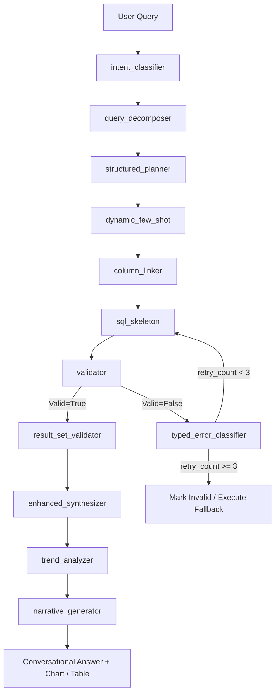

# ConvoQL Pipeline Architecture

ConvoQL is a LangGraph-orchestrated natural-language-to-SQL analytics system for personal finance databases. This document describes the runtime execution pipeline, schema-retrieval mechanisms, amount-sign conventions, retry loops, and multi-dialect design.

---

## 1. LangGraph Pipeline & State Flow

The ConvoQL pipeline consists of a sequential execution graph with a self-correcting error retry loop, managed by LangGraph. 

### Active Pipeline Nodes & State Transformations
1. **`intent_classifier`**: Detects primary and secondary user intents (e.g., aggregation, trends, balances) and table/column references. Writes `intent` back to state.
2. **`query_decomposer`**: Decomposes complex compound requests into simpler sub-queries. Writes `decomposition`.
3. **`structured_planner`**: An LLM-based planner that outputs a structured JSON query plan (specifying target tables, joins, select columns, where conditions, group by, order by, and limits). Writes `structured_plan`.
4. **`dynamic_few_shot`**: Selects target SQL examples from a static example bank matching the query's intent type. Writes `few_shot_examples`.
5. **`column_linker`**: Extracts specific entity filters (accounts, categories, merchants, tags, dates, and amounts) in parallel using rules and regex. Writes `entity_links`.
6. **`sql_skeleton`**: Integrates the structured plan and the extracted entity links, assembling the final raw SQL query string. Writes `generated_sql`.
7. **`validator`**: Run-time parser that executes static schema checks, query-plan validation, and `EXPLAIN QUERY PLAN` dry-runs on the generated SQL. Writes `valid` (True/False) and `error`.
8. **`typed_error_classifier`**: If validation fails, classifies the error (syntax, column hallucination, group-by error) and increments `retry_count`. Routes back to `sql_skeleton` for up to **3 retries** (configured via `MAX_RETRIES` in `config.py`).
9. **`result_set_validator`**: Runs post-execution checks on the output dataset (e.g., detecting if a ranking query returned too many rows, or if a non-empty check failed). Writes `result_set_valid`.
10. **`enhanced_synthesizer`**: Executes the query and formats the final query rows, chart configuration (`has_chart`, `chart_type`, `chart_title`), and table configuration (`has_table`) for the UI. Writes `answer`, `sql_result`, and `result`.
11. **`trend_analyzer`**: Detects month-over-month or category-specific trends when relevant.
12. **`narrative_generator`**: Enriches the final answer with a narrative summary of trends and insights.

---

## 2. Schema Retrieval & RAG Coordination

To avoid overwhelming LLM prompts with database details, ConvoQL uses two coordinating schema-retrieval mechanisms:

1. **`cache/schema_rag.py` (Keyword-Heuristic SchemaRAG)**: A non-LLM vector/keyword search that indexes all tables and columns. It scores and retrieves the top-k most relevant tables based on the user's question, ensuring that necessary tables are available to the planner.
2. **Structured Planner Table Detection**: The LLM uses the pruned SchemaRAG context to decide exactly which tables to include in the query plan.

---

## 3. Amount Sign & Aggregation Conventions

ConvoQL enforces a strict amount sign convention matching the personal finance domain model:
- **Debits (Expenses)**: Stored as **negative** amounts in the database.
- **Credits (Income)**: Stored as **positive** amounts in the database.

To ensure consistent math and visualization:
- When aggregating expenses, the pipeline wraps the amount column inside absolute value operations: `SUM(ABS(amount)) AS total_spent` or `MAX(ABS(amount))`.
- These absolute value wrappers are enforced automatically in two separate generation paths:
  1. The live pipeline `sql_skeleton.py` via `_enforce_abs_for_debits()`.
  2. The inactive generator `generator.py` via its own `_enforce_abs_for_debits()`.

---

## 4. Reachability of `generator.py`

- **Status**: **Unreachable Dead Code**.
- **Description**: The `generator.py` node (`generator_node`) represents a direct, single-prompt SQL generator. It is **not** currently wired into any edge in `graph.py`. The active pipeline utilizes the structured JSON plan pathway (`structured_planner` + `sql_skeleton`). It is preserved solely as a reference or a future fallback candidate.

---

## 5. Three-Dialect Abstraction

ConvoQL is designed to target three database backends dialect-sensitively:
1. **SQLite** (Default dialect utilized by the test suite)
2. **MySQL**
3. **PostgreSQL**

The dialect-specific functions are abstracted in:
- `db_adapter.py` (and mirrored in `sql_skeleton.py`) via the `DATE_FUNCTIONS` mapping.
- `structured_planner.py` via `DATE_TEMPLATES` for generation templates.
- `generator.py` via `DIALECT_EXAMPLES` containing sample dialect queries.
